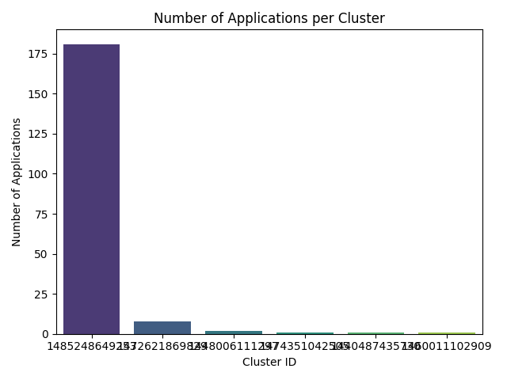
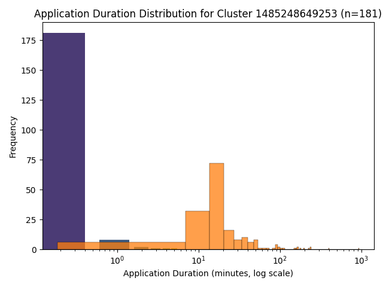

# Problem 1

In this problem we need to
- Read and parse log data
- Count log level
- Show 10 sample log entries with details
- Show summary stat

## **Approach**
- Extracted the log level (`INFO`, `WARN`, `ERROR`, `DEBUG`) using regex from each log line.
- Performed `groupBy` and `count` operations to compute frequency by log level.

## **Key Findings**
Here is the result for log data distribution:
| log_level | count |
|:------|-------:|
|INFO|27389482|
|WARN|9595|
|ERROR|11259|
|DEBUG|0|

Here I list 10 sample logs with details to have a better understanding:
|log_entry|log_level|
|"17/03/28 15:20:14 INFO BlockManagerInfo: Added broadcast_4_piece263 in memory on mesos-slave-05:34412 (size: 4.0 MB, free: 14.1 GB)"|INFO
|"17/06/07 15:42:03 INFO python.PythonRunner: Times: total = 40, boot = -91, init = 131, finish = 0"|INFO
|17/06/07 15:38:32 INFO executor.Executor: Finished task 33.0 in stage 379.0 (TID 15192). 2087 bytes result sent to driver|INFO
|17/06/09 17:04:34 INFO executor.Executor: Finished task 34.0 in stage 245.0 (TID 9837). 2198 bytes result sent to driver|INFO
|17/02/01 21:32:48 INFO executor.Executor: Running task 422.0 in stage 93.0 (TID 12124)|INFO
|17/06/09 10:32:44 INFO output.FileOutputCommitter: File Output Committer Algorithm version is 1|INFO
|"17/06/09 21:11:14 INFO python.PythonRunner: Times: total = 40, boot = -156, init = 196, finish = 0"|INFO
|17/06/09 18:41:41 INFO storage.BlockManager: Removing RDD 6675|INFO
|17/06/08 20:13:01 INFO executor.CoarseGrainedExecutorBackend: Got assigned task 353392|INFO
|17/06/09 13:19:38 INFO executor.Executor: Running task 37.0 in stage 13505.0 (TID 540675)|INFO

And here is the summary stats:

Run timestamp (UTC): 2025-10-28 01:06:25
Input path: s3a://hy536-assignment-spark-cluster-logs/data/**

Total log lines processed: 33,236,604
Total lines with log levels: 27,410,336
Unique log levels found: 3

Log level distribution:
  INFO : 27,389,482 (99.92%)
  WARN :      9,595 ( 0.04%)
  ERROR:     11,259 ( 0.04%)
  DEBUG:          0 ( 0.00%)

- Nearly **all logs (≈99.9 %)** are `INFO` messages, indicating stable Spark operation with minimal warnings or failures.
- Only ~0.08 % of logs contain `WARN` or `ERROR`, typically during executor startup or block shuffle stages.
- It is unsusal to have 0 debug tags. 


## Problem 2

## Approach 
- Extract identifiers and timestamps:
  - `application_id` from file path via `(application_\d+_\d+)`
  - `cluster_id` via `application_(\d+)_\d+`
  - `timestamp` via `^yy/MM/dd HH:mm:ss`
- Use **`try_to_timestamp`** to safely parse times and **filter out null timestamps** to avoid ANSI parse errors.
- Compute per-app start/end times with `min(timestamp)` and `max(timestamp)`.
- Create timeline (`problem2_timeline.csv`) and per-cluster summary (`problem2_cluster_summary.csv`).
- Generate charts:
  - Bar chart: applications per cluster.
  - Density/histogram (log x-axis): durations within the largest cluster.

## Results

**Cluster summary (top to bottom):**
```
cluster_id,num_applications,cluster_first_app,cluster_last_app
1485248649253,181,2017-01-24 17:00:28,2017-07-27 21:45:00
1472621869829,8,2016-09-09 07:43:47,2016-09-09 10:07:06
1448006111297,2,2016-04-07 10:45:21,2016-04-07 12:22:08
1474351042505,1,2016-11-18 22:30:06,2016-11-19 00:59:04
1440487435730,1,2015-09-01 18:14:40,2015-09-01 18:19:50
1460011102909,1,2016-07-26 11:54:20,2016-07-26 12:19:25
```

**Overall stats:**
```
Total unique clusters: 6
Total applications: 194
Average applications per cluster: 32.33
```

**Most heavily used clusters:**
- 1485248649253: **181** apps
- 1472621869829: 8 apps
- 1448006111297: 2 apps
- 1474351042505: 1 app
- 1440487435730: 1 app
- 1460011102909: 1 app

**Visualizations:** 





**Interpretation:**  
- The workload is highly concentrated on cluster **1485248649253**.  
- Durations are **right‑skewed** with many short jobs and a long tail (log scale). This suggests a mix of quick batch jobs and occasional heavier workloads.

## Performance & Optimization 
- Using `try_to_timestamp` and `filter(isNotNull)` avoided failures from malformed lines.
- Aggregations done after extracting only necessary columns reduced IO.
